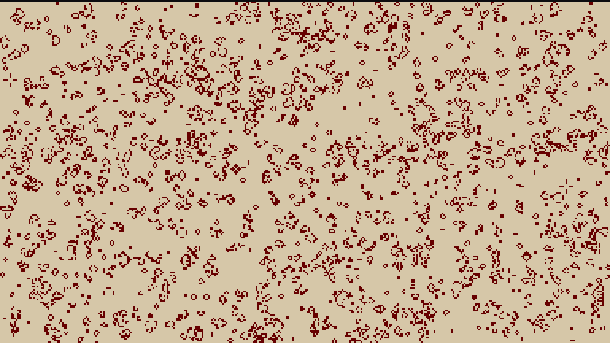

#gl\_GameOfLife

This is an implementation of the **Conway's Game of Life** using **OpenGL**. The purpose of this project is to gain a better grasp of the OpenGL's basic features.

# Building

On linux systems, you'll need **SDL2** and **OpenGL**. To build it, just execute `make` on the root of the project.
